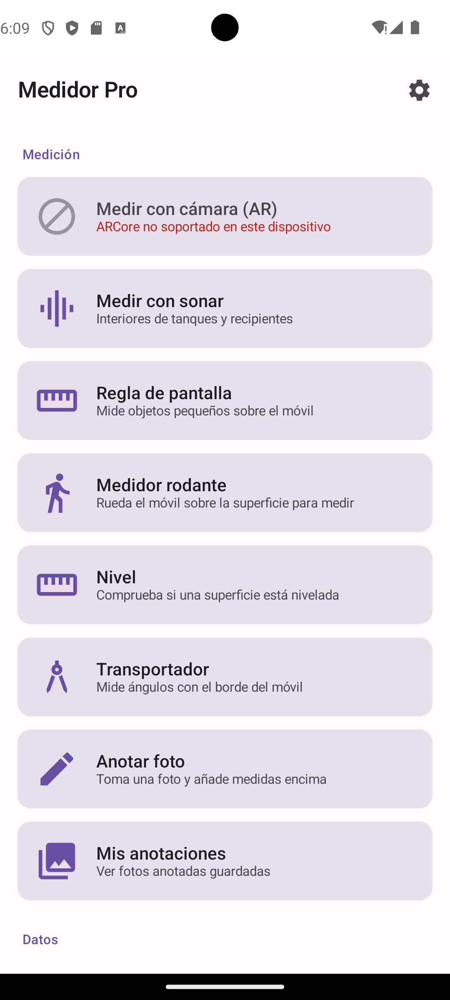
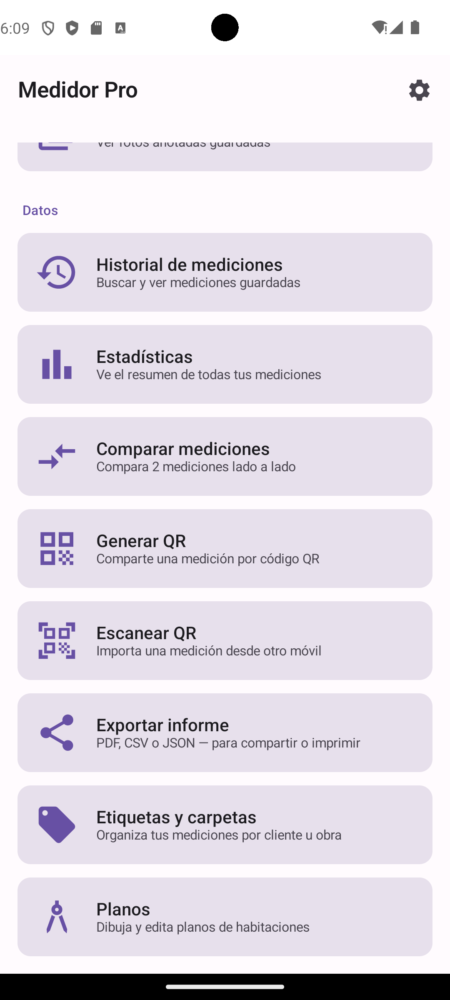
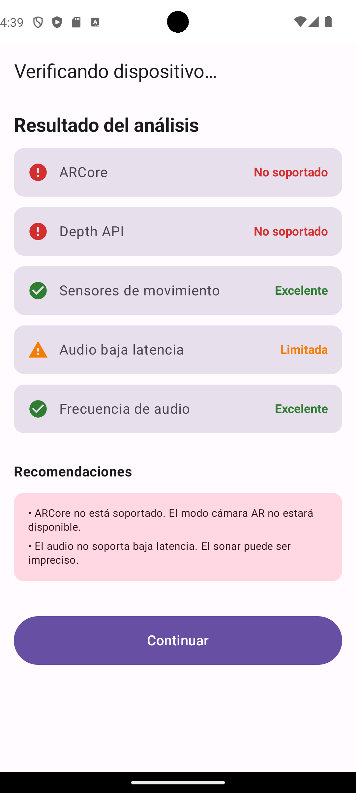
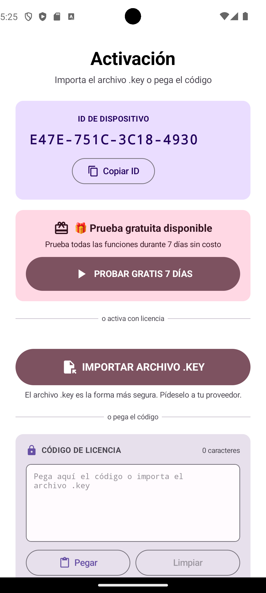
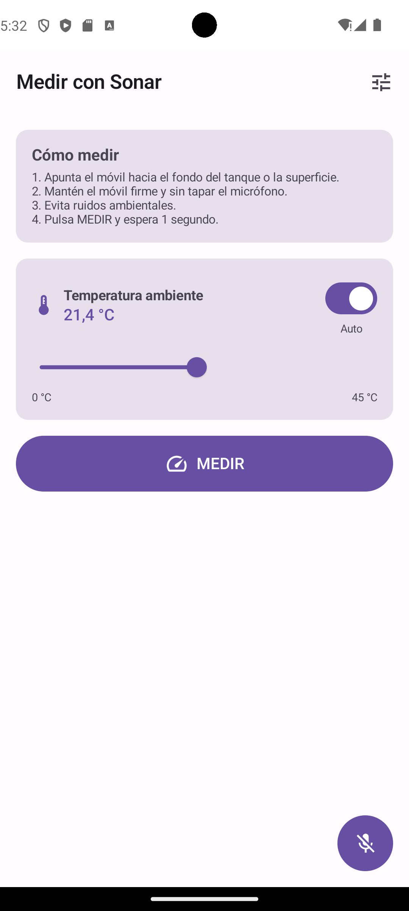
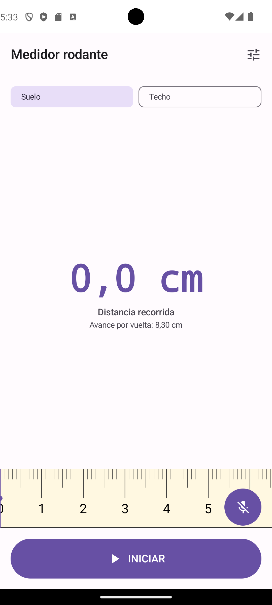
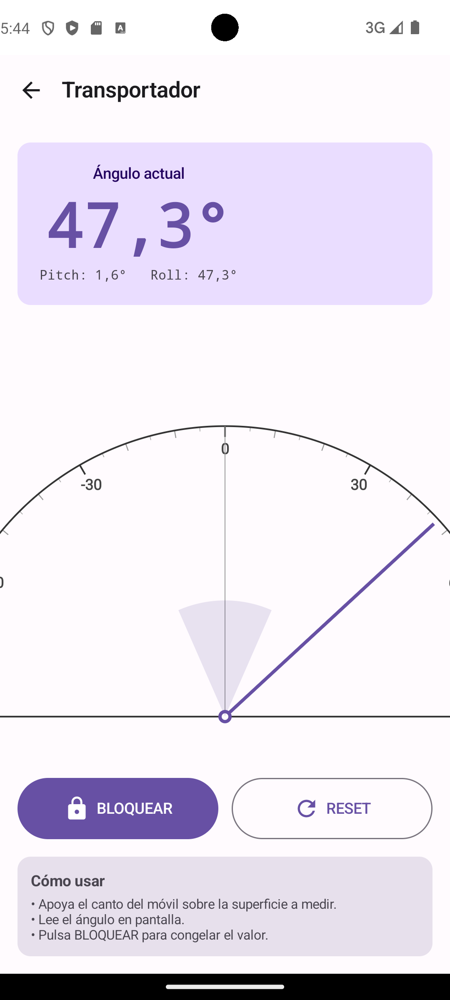
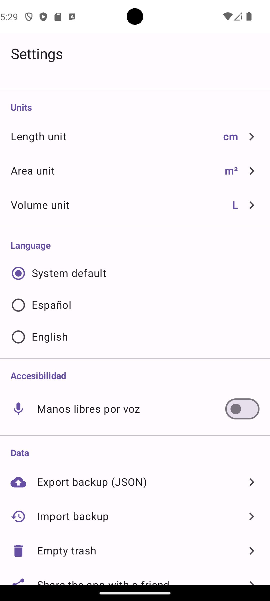
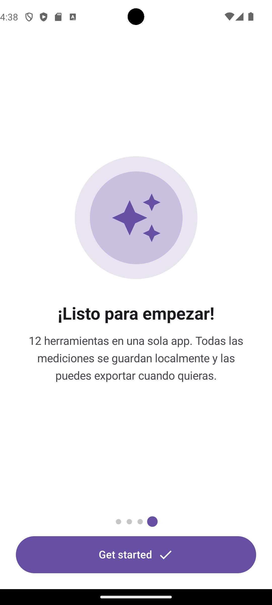

# MedidorPro - Android Showcase

Aplicación Android integral para medir distancias y ángulos con múltiples herramientas: realidad aumentada (AR), sonar (ultrasonido), regla de pantalla, medidor rodante, nivel y transportador.

> **Nota:** El código fuente completo es privado. Este repositorio muestra la arquitectura, las características y capturas de pantalla de la aplicación.

## 📱 Características Principales

### Herramientas de Medición
- **Regla de Pantalla:** Calibración manual con tarjeta de crédito (54mm) y calibración automática con OpenCV.
- **Medidor Rodante:** Uso del giroscopio para medir distancias rodando el celular, sin necesidad de calibración por rodado.
- **Nivel de Burbuja:** Nivel digital con indicador de inclinación y calibración automática.
- **Transportador:** Medición de ángulos con la cámara, soporta ángulos agudos y obtusos.

### Medición AR (Realidad Aumentada)
- Medición de distancias usando la cámara y ARCore.
- Detección automática de planos y objetos.
- **Medición de altura:** Mide la altura de puertas, muebles o personas.

### Medición Sonar (Ultrasonido)
- Medición de distancias usando el micrófono.
- Calibración automática y ajuste de temperatura para mayor precisión.
- Visualización de espectro de audio.

### Anotaciones y Planos
- **Anotaciones de Fotos:** Dibuja líneas, rectángulos y círculos con medidas sobre tus fotos.
- **Planos:** Dibuja y edita planos de habitaciones, añade medidas y exporta a imagen.

### Gestión de Mediciones
- Historial, favoritos y papelera.
- Exportación a PDF, CSV y JSON.
- Etiquetas y carpetas para organizar por cliente u obra.
- Estadísticas visuales y comparación de mediciones.
- Generación y escaneo de códigos QR.

### Sistema de Unidades
- Longitud: cm, m, pulgadas, pies.
- Área: cm², m², in², ft².
- Volumen: cm³, m³, in³, ft³.
- Configuración de preferencias por usuario.

### Extras
- **Widget de Inicio Rápido:** Accesos directos a AR, Sonar, Rodante e Historial.
- **Onboarding Interactivo:** Guía de bienvenida animada con 4 páginas.
- **Sistema de Licencias:** Prueba gratuita de 7 días, planes Básico, Pro y Premium con activación por JWT.

## 🛠️ Stack Tecnológico

- **Lenguaje:** Kotlin
- **Arquitectura:** Modular (data, ui, utils, licencia, export)
- **AR:** ARCore
- **Visión por Computadora:** OpenCV (detección de tarjetas para calibración)
- **Sensores:** Giroscopio, micrófono, cámara
- **UI:** Material Design, Onboarding animado, Widget de inicio
- **Exportación:** PDF, CSV, JSON
- **Licencias:** JWT (JSON Web Tokens)
- **Feedback:** Haptica (respuesta háptica)

## 📸 Capturas de Pantalla

### Menú Principal
*   **Sección de Medición:** 
*   **Sección de Datos:** 

### Herramientas y Sistema
*   **Verificación de Dispositivo:** 
*   **Activación de Licencia:** 
*   **Medir con Sonar:** 
*   **Medidor Rodante:** 
*   **Transportador:** 
*   **Configuración:** 
*   **Onboarding:** 

## 💻 Fragmentos de Código Destacados

*(Próximamente: fragmentos de `MedidorRodante.kt`, `DetectorTarjeta.kt` y `PruebaManager.kt`)*

## 👨‍💻 Mi Rol en el Proyecto
Desarrollador Android. Responsable de la arquitectura, implementación, integración de ARCore y OpenCV, sistema de licencias y UI/UX.

## 📄 Licencia
Este proyecto es una muestra de portafolio. Todos los derechos reservados.
